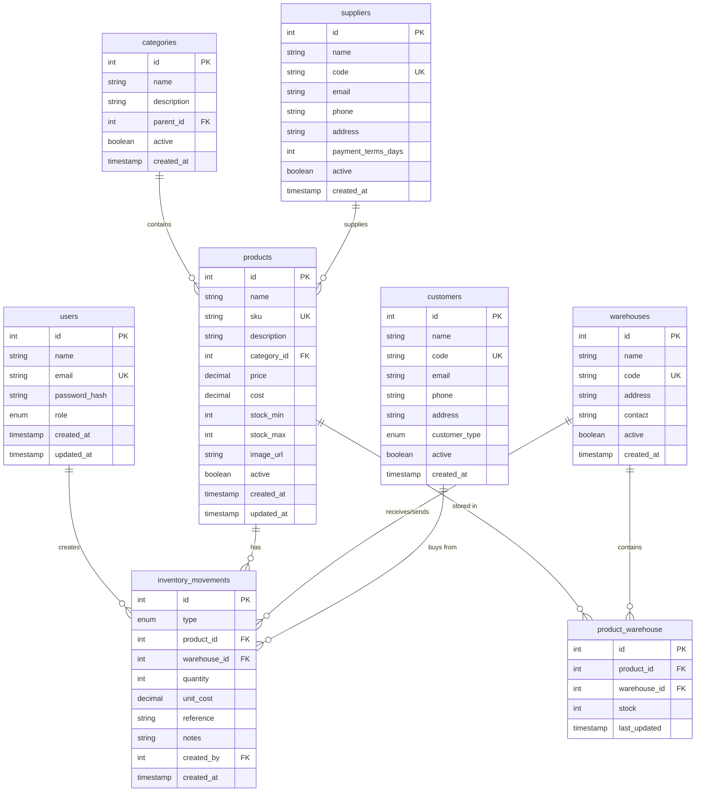

# 🗄️ Diseño de Base de datos - Sistema de Inventario Global

## 📊 Diagrama de Entidad-Relación



---

## 📋 Descripción Detallada de Tablas

### 1. **users** - Usuarios del Sistema

Almacena información de los usuarios que pueden acceder al sistema.

| Campo | Tipo | Constraints | Descripción |
|-------|------|-------------|-------------|
| id | SERIAL | PRIMARY KEY | Identificador único |
| name | VARCHAR(100) | NOT NULL | Nombre completo del usuario |
| email | VARCHAR(150) | NOT NULL, UNIQUE | Email para login |
| password_hash | VARCHAR(255) | NOT NULL | Password encriptado (bcrypt) |
| role | ENUM | NOT NULL | 'admin', 'manager', 'operator', 'viewer' |
| active | BOOLEAN | DEFAULT TRUE | Si el usuario está activo |
| last_login | TIMESTAMP | NULL | Última vez que inició sesión |
| created_at | TIMESTAMP | DEFAULT NOW() | Fecha de creación |
| updated_at | TIMESTAMP | DEFAULT NOW() | Última actualización |

**Índices:**
- `idx_users_email` en `email`
- `idx_users_role` en `role`

**Roles y Permisos:**
- **admin**: Acceso total al sistema
- **manager**: Ver reportes, gestionar productos e inventario
- **operator**: Registrar movimientos de inventario
- **viewer**: Solo lectura

---

### 2. **categories** - Categorías de Productos

Organización jerárquica de productos. Soporta subcategorías.

| Campo | Tipo | Constraints | Descripción |
|-------|------|-------------|-------------|
| id | SERIAL | PRIMARY KEY | Identificador único |
| name | VARCHAR(100) | NOT NULL | Nombre de la categoría |
| description | TEXT | NULL | Descripción opcional |
| parent_id | INTEGER | NULL, FK(categories.id) | Categoría padre (para subcategorías) |
| level | INTEGER | DEFAULT 0 | Nivel jerárquico (0=raíz, 1=subcategoría, etc) |
| active | BOOLEAN | DEFAULT TRUE | Si está activa |
| created_at | TIMESTAMP | DEFAULT NOW() | Fecha de creación |

**Índices:**
- `idx_categories_parent` en `parent_id`
- `idx_categories_active` en `active`

**Ejemplo de jerarquía:**
```
Electrónica (parent_id: NULL, level: 0)
  └── Computadoras (parent_id: 1, level: 1)
      └── Laptops (parent_id: 2, level: 2)
```

---

### 3. **products** - Productos

Catálogo de todos los productos del inventario.

| Campo | Tipo | Constraints | Descripción |
|-------|------|-------------|-------------|
| id | SERIAL | PRIMARY KEY | Identificador único |
| name | VARCHAR(200) | NOT NULL | Nombre del producto |
| sku | VARCHAR(50) | NOT NULL, UNIQUE | Código único del producto |
| barcode | VARCHAR(100) | NULL, UNIQUE | Código de barras |
| description | TEXT | NULL | Descripción detallada |
| category_id | INTEGER | NOT NULL, FK(categories.id) | Categoría del producto |
| supplier_id | INTEGER | NULL, FK(suppliers.id) | Proveedor principal |
| price | DECIMAL(10,2) | NOT NULL | Precio de venta |
| cost | DECIMAL(10,2) | NOT NULL | Costo de adquisición |
| margin | DECIMAL(5,2) | GENERATED | (price - cost) / price * 100 |
| stock_min | INTEGER | DEFAULT 0 | Stock mínimo (alerta) |
| stock_max | INTEGER | DEFAULT 0 | Stock máximo recomendado |
| image_url | VARCHAR(500) | NULL | URL de la imagen |
| unit | VARCHAR(20) | DEFAULT 'unidad' | Unidad de medida |
| active | BOOLEAN | DEFAULT TRUE | Si está activo |
| created_at | TIMESTAMP | DEFAULT NOW() | Fecha de creación |
| updated_at | TIMESTAMP | DEFAULT NOW() | Última actualización |

**Índices:**
- `idx_products_sku` en `sku` (único)
- `idx_products_barcode` en `barcode` (único)
- `idx_products_category` en `category_id`
- `idx_products_active` en `active`
- `idx_products_name` en `name` (para búsquedas)

**Validaciones:**
- `price >= 0`
- `cost >= 0`
- `stock_min >= 0`
- `stock_max >= stock_min`

---

### 4. **warehouses** - Almacenes/Ubicaciones

Diferentes ubicaciones físicas donde se almacena inventario.

| Campo | Tipo | Constraints | Descripción |
|-------|------|-------------|-------------|
| id | SERIAL | PRIMARY KEY | Identificador único |
| name | VARCHAR(100) | NOT NULL | Nombre del almacén |
| code | VARCHAR(20) | NOT NULL, UNIQUE | Código corto (ej: "ALM-01") |
| address | VARCHAR(255) | NULL | Dirección física |
| city | VARCHAR(100) | NULL | Ciudad |
| phone | VARCHAR(20) | NULL | Teléfono de contacto |
| manager | VARCHAR(100) | NULL | Encargado del almacén |
| active | BOOLEAN | DEFAULT TRUE | Si está activo |
| created_at | TIMESTAMP | DEFAULT NOW() | Fecha de creación |

**Índices:**
- `idx_warehouses_code` en `code` (único)
- `idx_warehouses_active` en `active`

---

### 5. **product_warehouse** - Stock por Almacén

Tabla pivote que mantiene el stock actual de cada producto en cada almacén.

| Campo | Tipo | Constraints | Descripción |
|-------|------|-------------|-------------|
| id | SERIAL | PRIMARY KEY | Identificador único |
| product_id | INTEGER | NOT NULL, FK(products.id) | Producto |
| warehouse_id | INTEGER | NOT NULL, FK(warehouses.id) | Almacén |
| stock | INTEGER | NOT NULL, DEFAULT 0 | Cantidad actual en stock |
| reserved | INTEGER | DEFAULT 0 | Cantidad reservada (pedidos) |
| available | INTEGER | GENERATED | stock - reserved |
| last_movement_date | TIMESTAMP | NULL | Última vez que hubo movimiento |
| created_at | TIMESTAMP | DEFAULT NOW() | Fecha de creación |
| updated_at | TIMESTAMP | DEFAULT NOW() | Última actualización |

**Constraints Únicos:**
- `UNIQUE(product_id, warehouse_id)` - Un producto solo puede tener un registro por almacén

**Índices:**
- `idx_pw_product` en `product_id`
- `idx_pw_warehouse` en `warehouse_id`
- `idx_pw_stock` en `stock` (para alertas de stock bajo)

**Validaciones:**
- `stock >= 0`
- `reserved >= 0`
- `reserved <= stock`

---

### 6. **inventory_movements** - Movimientos de Inventario

Registro de todas las entradas, salidas y transferencias de inventario.

| Campo | Tipo | Constraints | Descripción |
|-------|------|-------------|-------------|
| id | SERIAL | PRIMARY KEY | Identificador único |
| type | ENUM | NOT NULL | 'entrada', 'salida', 'transferencia', 'ajuste' |
| product_id | INTEGER | NOT NULL, FK(products.id) | Producto afectado |
| warehouse_id | INTEGER | NOT NULL, FK(warehouses.id) | Almacén de origen/destino |
| warehouse_dest_id | INTEGER | NULL, FK(warehouses.id) | Almacén destino (solo transferencias) |
| quantity | INTEGER | NOT NULL | Cantidad (+/-) |
| unit_cost | DECIMAL(10,2) | NULL | Costo unitario del movimiento |
| total_cost | DECIMAL(10,2) | GENERATED | quantity * unit_cost |
| reference | VARCHAR(100) | NULL | Núm. factura, orden, etc. |
| notes | TEXT | NULL | Observaciones |
| customer_id | INTEGER | NULL, FK(customers.id) | Cliente (si es venta) |
| supplier_id | INTEGER | NULL, FK(suppliers.id) | Proveedor (si es compra) |
| created_by | INTEGER | NOT NULL, FK(users.id) | Usuario que registró |
| created_at | TIMESTAMP | DEFAULT NOW() | Fecha y hora del movimiento |

**Índices:**
- `idx_movements_product` en `product_id`
- `idx_movements_warehouse` en `warehouse_id`
- `idx_movements_type` en `type`
- `idx_movements_created_at` en `created_at` (para reportes por fecha)
- `idx_movements_reference` en `reference`

**Tipos de Movimiento:**
- **entrada**: Compras, devoluciones de clientes
- **salida**: Ventas, mermas, consumo interno
- **transferencia**: Mover entre almacenes
- **ajuste**: Corrección por inventario físico

**Validaciones:**
- `quantity <> 0`
- Si `type = 'transferencia'` entonces `warehouse_dest_id IS NOT NULL`
- `unit_cost >= 0`

---

### 7. **suppliers** - Proveedores

Catálogo de proveedores.

| Campo | Tipo | Constraints | Descripción |
|-------|------|-------------|-------------|
| id | SERIAL | PRIMARY KEY | Identificador único |
| name | VARCHAR(200) | NOT NULL | Nombre o razón social |
| code | VARCHAR(20) | NOT NULL, UNIQUE | Código interno |
| tax_id | VARCHAR(50) | NULL | RFC/RUT/NIT |
| email | VARCHAR(150) | NULL | Email de contacto |
| phone | VARCHAR(20) | NULL | Teléfono |
| mobile | VARCHAR(20) | NULL | Celular |
| address | VARCHAR(255) | NULL | Dirección |
| city | VARCHAR(100) | NULL | Ciudad |
| country | VARCHAR(100) | DEFAULT 'México' | País |
| payment_terms_days | INTEGER | DEFAULT 30 | Días de crédito |
| contact_person | VARCHAR(100) | NULL | Persona de contacto |
| notes | TEXT | NULL | Notas adicionales |
| active | BOOLEAN | DEFAULT TRUE | Si está activo |
| created_at | TIMESTAMP | DEFAULT NOW() | Fecha de creación |

**Índices:**
- `idx_suppliers_code` en `code` (único)
- `idx_suppliers_active` en `active`

---

### 8. **customers** - Clientes

Catálogo de clientes (opcional, útil para trazabilidad de ventas).

| Campo | Tipo | Constraints | Descripción |
|-------|------|-------------|-------------|
| id | SERIAL | PRIMARY KEY | Identificador único |
| name | VARCHAR(200) | NOT NULL | Nombre o razón social |
| code | VARCHAR(20) | NOT NULL, UNIQUE | Código interno |
| tax_id | VARCHAR(50) | NULL | RFC/RUT/NIT |
| email | VARCHAR(150) | NULL | Email |
| phone | VARCHAR(20) | NULL | Teléfono |
| address | VARCHAR(255) | NULL | Dirección |
| customer_type | ENUM | DEFAULT 'retail' | 'retail', 'wholesale', 'distributor' |
| credit_limit | DECIMAL(10,2) | DEFAULT 0 | Límite de crédito |
| active | BOOLEAN | DEFAULT TRUE | Si está activo |
| created_at | TIMESTAMP | DEFAULT NOW() | Fecha de creación |

**Índices:**
- `idx_customers_code` en `code` (único)
- `idx_customers_type` en `customer_type`
- `idx_customers_active` en `active`

---

## 🔗 Relaciones Principales

### One-to-Many (1:N)
1. **categories → products**: Una categoría puede tener muchos productos
2. **warehouses → product_warehouse**: Un almacén puede almacenar muchos productos
3. **products → product_warehouse**: Un producto puede estar en muchos almacenes
4. **products → inventory_movements**: Un producto tiene muchos movimientos
5. **users → inventory_movements**: Un usuario crea muchos movimientos
6. **suppliers → products**: Un proveedor puede suministrar muchos productos

### Self-Referencing
1. **categories → categories**: Una categoría puede tener subcategorías (parent_id)

---

## 📌 Constraints y Validaciones Importantes

### Check Constraints
```sql
-- Productos
ALTER TABLE products ADD CONSTRAINT chk_price_positive CHECK (price >= 0);
ALTER TABLE products ADD CONSTRAINT chk_cost_positive CHECK (cost >= 0);
ALTER TABLE products ADD CONSTRAINT chk_stock_limits CHECK (stock_max >= stock_min);

-- Stock por almacén
ALTER TABLE product_warehouse ADD CONSTRAINT chk_stock_positive CHECK (stock >= 0);
ALTER TABLE product_warehouse ADD CONSTRAINT chk_reserved_valid CHECK (reserved >= 0 AND reserved <= stock);

-- Movimientos
ALTER TABLE inventory_movements ADD CONSTRAINT chk_quantity_nonzero CHECK (quantity <> 0);
ALTER TABLE inventory_movements ADD CONSTRAINT chk_unit_cost_positive CHECK (unit_cost IS NULL OR unit_cost >= 0);
```

### Foreign Key Constraints
Todas las FK tienen `ON DELETE RESTRICT` para prevenir eliminación accidental de datos relacionados.

### Unique Constraints
- `users.email`
- `products.sku`
- `products.barcode`
- `warehouses.code`
- `suppliers.code`
- `customers.code`
- `product_warehouse(product_id, warehouse_id)`

---

## 🔍 Índices para Optimización

### Índices de Búsqueda
```sql
-- Búsqueda de productos por nombre
CREATE INDEX idx_products_name_trgm ON products USING gin(name gin_trgm_ops);

-- Búsqueda por SKU y barcode
CREATE INDEX idx_products_sku ON products(sku);
CREATE INDEX idx_products_barcode ON products(barcode) WHERE barcode IS NOT NULL;
```

### Índices para Reportes
```sql
-- Movimientos por fecha (para reportes)
CREATE INDEX idx_movements_created_at ON inventory_movements(created_at DESC);

-- Productos con stock bajo
CREATE INDEX idx_pw_low_stock ON product_warehouse(stock) WHERE stock > 0;

-- Productos activos
CREATE INDEX idx_products_active ON products(active) WHERE active = true;
```

---

## 📊 Vistas Útiles (Views)

### Vista: Stock Global por Producto
```sql
CREATE VIEW v_product_stock AS
SELECT 
    p.id,
    p.name,
    p.sku,
    COALESCE(SUM(pw.stock), 0) as total_stock,
    COALESCE(SUM(pw.reserved), 0) as total_reserved,
    COALESCE(SUM(pw.available), 0) as total_available,
    p.stock_min,
    p.stock_max,
    CASE 
        WHEN COALESCE(SUM(pw.stock), 0) <= p.stock_min THEN 'low'
        WHEN COALESCE(SUM(pw.stock), 0) >= p.stock_max THEN 'high'
        ELSE 'normal'
    END as stock_status
FROM products p
LEFT JOIN product_warehouse pw ON p.id = pw.product_id
WHERE p.active = true
GROUP BY p.id, p.name, p.sku, p.stock_min, p.stock_max;
```

### Vista: Productos con Alerta de Stock Bajo
```sql
CREATE VIEW v_low_stock_alerts AS
SELECT 
    p.id,
    p.name,
    p.sku,
    c.name as category,
    COALESCE(SUM(pw.stock), 0) as current_stock,
    p.stock_min,
    p.stock_min - COALESCE(SUM(pw.stock), 0) as quantity_needed
FROM products p
LEFT JOIN product_warehouse pw ON p.id = pw.product_id
LEFT JOIN categories c ON p.category_id = c.id
WHERE p.active = true
GROUP BY p.id, p.name, p.sku, c.name, p.stock_min
HAVING COALESCE(SUM(pw.stock), 0) <= p.stock_min;
```

### Vista: Resumen de Movimientos por Mes
```sql
CREATE VIEW v_movements_monthly AS
SELECT 
    DATE_TRUNC('month', created_at) as month,
    type,
    COUNT(*) as total_movements,
    SUM(quantity) as total_quantity,
    SUM(total_cost) as total_value
FROM inventory_movements
GROUP BY DATE_TRUNC('month', created_at), type
ORDER BY month DESC, type;
```

---

## 🎯 Funciones y Triggers Importantes

### Trigger: Actualizar Stock Automáticamente
```sql
-- Función que se ejecuta después de insertar un movimiento
CREATE OR REPLACE FUNCTION update_stock_after_movement()
RETURNS TRIGGER AS $$
BEGIN
    -- Para entradas, transferencias destino, y ajustes positivos
    IF NEW.type = 'entrada' OR 
       (NEW.type = 'transferencia' AND NEW.warehouse_dest_id IS NOT NULL) OR
       (NEW.type = 'ajuste' AND NEW.quantity > 0) THEN
        
        UPDATE product_warehouse
        SET stock = stock + NEW.quantity,
            last_movement_date = NOW()
        WHERE product_id = NEW.product_id 
          AND warehouse_id = COALESCE(NEW.warehouse_dest_id, NEW.warehouse_id);
        
        -- Crear registro si no existe
        IF NOT FOUND THEN
            INSERT INTO product_warehouse (product_id, warehouse_id, stock, last_movement_date)
            VALUES (NEW.product_id, COALESCE(NEW.warehouse_dest_id, NEW.warehouse_id), NEW.quantity, NOW());
        END IF;
    END IF;
    
    -- Para salidas, transferencias origen, y ajustes negativos
    IF NEW.type = 'salida' OR 
       NEW.type = 'transferencia' OR
       (NEW.type = 'ajuste' AND NEW.quantity < 0) THEN
        
        UPDATE product_warehouse
        SET stock = stock - ABS(NEW.quantity),
            last_movement_date = NOW()
        WHERE product_id = NEW.product_id 
          AND warehouse_id = NEW.warehouse_id;
    END IF;
    
    RETURN NEW;
END;
$$ LANGUAGE plpgsql;

-- Trigger
CREATE TRIGGER trg_update_stock
AFTER INSERT ON inventory_movements
FOR EACH ROW
EXECUTE FUNCTION update_stock_after_movement();
```

### Trigger: Actualizar updated_at
```sql
CREATE OR REPLACE FUNCTION update_updated_at_column()
RETURNS TRIGGER AS $$
BEGIN
    NEW.updated_at = NOW();
    RETURN NEW;
END;
$$ LANGUAGE plpgsql;

-- Aplicar a tablas relevantes
CREATE TRIGGER trg_products_updated_at
BEFORE UPDATE ON products
FOR EACH ROW
EXECUTE FUNCTION update_updated_at_column();

CREATE TRIGGER trg_users_updated_at
BEFORE UPDATE ON users
FOR EACH ROW
EXECUTE FUNCTION update_updated_at_column();
```

---

## 📈 Estadísticas y Métricas Clave

### Consultas SQL Útiles

**1. Stock Total por Categoría**
```sql
SELECT 
    c.name as category,
    COUNT(DISTINCT p.id) as products_count,
    SUM(pw.stock) as total_units,
    SUM(pw.stock * p.cost) as total_value_cost,
    SUM(pw.stock * p.price) as total_value_price
FROM categories c
JOIN products p ON c.id = p.category_id
JOIN product_warehouse pw ON p.id = pw.product_id
WHERE p.active = true
GROUP BY c.id, c.name
ORDER BY total_value_cost DESC;
```

**2. Productos Más Vendidos (últimos 30 días)**
```sql
SELECT 
    p.name,
    p.sku,
    COUNT(im.id) as transactions,
    SUM(ABS(im.quantity)) as units_sold,
    SUM(ABS(im.total_cost)) as revenue
FROM products p
JOIN inventory_movements im ON p.id = im.product_id
WHERE im.type = 'salida'
  AND im.created_at >= NOW() - INTERVAL '30 days'
GROUP BY p.id, p.name, p.sku
ORDER BY units_sold DESC
LIMIT 10;
```

**3. Valorización Total del Inventario**
```sql
SELECT 
    SUM(pw.stock * p.cost) as inventory_value_cost,
    SUM(pw.stock * p.price) as inventory_value_price,
    SUM(pw.stock * (p.price - p.cost)) as potential_margin,
    COUNT(DISTINCT p.id) as unique_products,
    SUM(pw.stock) as total_units
FROM product_warehouse pw
JOIN products p ON pw.product_id = p.id
WHERE p.active = true AND pw.stock > 0;
```

**4. Movimientos de Hoy**
```sql
SELECT 
    TO_CHAR(created_at, 'HH24:MI') as time,
    type,
    p.name as product,
    quantity,
    w.name as warehouse,
    u.name as user
FROM inventory_movements im
JOIN products p ON im.product_id = p.id
JOIN warehouses w ON im.warehouse_id = w.id
JOIN users u ON im.created_by = u.id
WHERE DATE(im.created_at) = CURRENT_DATE
ORDER BY im.created_at DESC;
```

---

## 🔐 Consideraciones de Seguridad

1. **Auditoría**: Todas las tablas críticas tienen `created_at` y `created_by`
2. **Soft Deletes**: Campo `active` en lugar de DELETE físico
3. **Trazabilidad**: La tabla `inventory_movements` nunca se borra, solo se ajusta
4. **Integridad**: Foreign Keys y Checks previenen datos inconsistentes
5. **Histórico**: `inventory_movements` mantiene registro completo para auditorías

---

## 📝 Notas de Implementación

### Prioridad de Implementación

**Fase 1 (Core):**
1. ✅ users
2. ✅ categories
3. ✅ warehouses
4. ✅ products
5. ✅ product_warehouse

**Fase 2 (Movimientos):**
6. ✅ suppliers
7. ✅ inventory_movements

**Fase 3 (Opcional):**
8. ✅ customers (si se requiere trazabilidad de ventas)

### Extensiones Futuras

Para escalar el sistema, considera agregar:
- **purchase_orders**: Órdenes de compra a proveedores
- **sales_orders**: Órdenes de venta a clientes
- **product_batches**: Lotes con fecha de vencimiento
- **stocktakes**: Inventarios físicos programados
- **alerts**: Sistema de alertas configurables
- **audit_logs**: Log de todos los cambios en el sistema

---

**Siguiente paso:** Crear el script SQL completo para PostgreSQL
